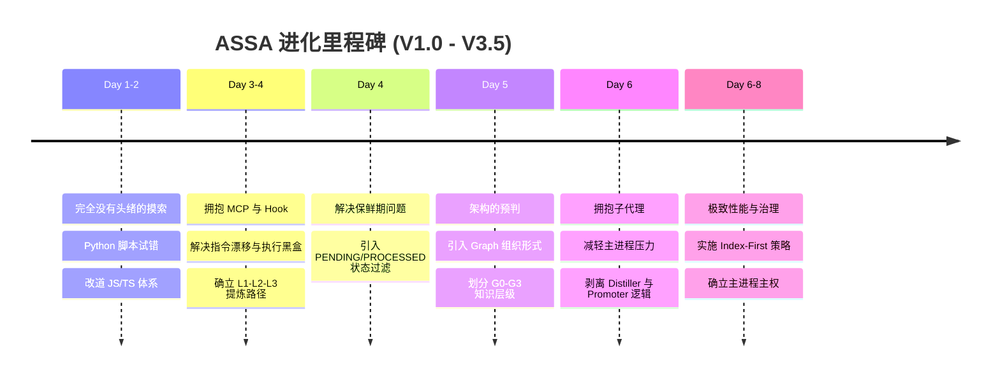

    

        ASSA V3.5 Evolution Report
    

作为一个穷学生，已经重度使用 geminicli 三个月了，在惊叹于 gemini 的智商之余，笔者也常被它的健忘和幻觉所困扰。不断重复地提示它相同的错误，或者在大项目的情况下，它经常罔顾事实乱改代码，这些确实让人头痛。

最近 openclaw 爆火，我也去体验了一下，确实好玩，但感觉它似乎还不太能作为一个称手的工具来进行科研或开发。不过群众的智慧是无穷的，在浏览 clawhub 的过程中，我看到了许多让人眼前一亮的 skill（技能）。受到其中 self-evolment（自我演进）思路的启发，我在 geminicli 的扩展库里转了一圈，发现还没有类似的插件，便一拍脑袋，决定自己开发一个扩展，看看能不能对平常的使用有所帮助。这也是我在 ReAct 系统（推理与行动循环）里的第一次尝试。个人使用下来感觉还可以，记忆能力确实得到了一些提升，但长期效果还有待验证。

在这过程中感慨良多，果然还是得靠日常实践去尝试，才能够发现技术细节上的问题并思考出解决方法。一切进步都建立在不断的试错中，如果不去试错，就永远无法进步。马克思曾说，人类的知识都来源于生产实践。唯有多做，才能进步。

整个过程的思路让 AI 总结了一下，放在下面，欢迎大家阅读或体验我开发的插件（虽然目前只有我一个人 star）。

---

## 01. 进化时间轴：八天之火

在一周多的时间里，我们经历了一场“压缩进化”。从最初的纵向记忆构建，到最后的横向秩序重塑。

---

## 02. 完全没有头绪的摸索 (Day 1-2)

最开始开发的时候，真的是完全没有头绪的摸索。

我先让 AI 用 Python 写了一个初版，尝试通过简单的脚本去拦截和记录对话。但这马上就暴露出问题：Python 脚本需要额外安装依赖（比如每次都要 pip install），而且与 Geminicli 原生基于 TypeScript/Node.js 的架构显得格格不入。在实际运行中，这种跨语言的调用导致环境非常不稳定，经常卡死。

在经历了最初两天的折腾后，我果断放弃了 Python 路线，决定遵循 Geminicli 的原生生态，全面改道 JS/TS。这是走向工程正规化的第一步，虽然推翻重来很痛苦，但这为后来的高性能 Hook 机制打下了基础。

---

## 03. 拥抱 MCP 与 Hook 机制，确立演进路径 (Day 3-4)

在改道 JS 之后，我开始仔细学习 Geminicli 里面给开发者留的工具。

我搞懂了什么是“钩子”（Hooks）——这就像是在 AI 思考前（BeforeAgent）和工具执行后（AfterTool）插上的“眼线”。我开始尝试用 MCP (Model Context Protocol) 工具来提炼日常的报错和纠偏信息。

在这个不断地讨论和尝试的过程中，我和 AI 共同总结出了一个非常有用的概念：**L1-L2-L3 的知识提炼路径**。
- **L1 (Ledger)**：像账本一样记录原始的纠错信号和报错信息。
- **L2 (Local)**：提炼成当前项目的开发习惯和特定模式。
- **L3 (Global)**：晋升为跨项目的全局准则。

感觉这种层层递进的方式最符合人类开发者平时做总结的习惯，知识不再是一团乱麻，而是有了一条清晰的晋升通道。

    

        <h3 class="text-indigo-600 dark:text-indigo-400 font-bold mb-3 flex items-center">
            物理标记 (Metadata)
        </h3>
        

            不再只靠 AI 自己的语义记忆，而是通过 Hook 在每一次工具输出中强行注入物理标识。这建立了一个客观的坐标，确保它报告的成功是基于文件变动的真实情况。
        

    

    

        <h3 class="text-purple-600 dark:text-purple-400 font-bold mb-3 flex items-center">
            语义情绪传感器 (Reflex)
        </h3>
        

            利用 AI 对交互情绪的理解。当我纠偏错误或给予肯定（如“很好”、“不对”）时，系统会自动捕捉这些信号，并立即触发反馈流程，将当下的教训记录下来。
        

    

---

## 04. 解决知识的“保鲜期”问题 (Day 4)

随着交互的增加，我感觉单纯的累积事实肯定不行。日志文件变得越来越长，如果每次提炼都要读取所有的历史记录，Token 消耗和响应时间都会爆炸。

AI 提出了一些基于向量检索或摘要压缩的方法，但我感觉都不太好，过于复杂且容易丢失细节。

后来，我自己想出来了一个简单粗暴的方法：“过期/已处理”和“新鲜”的知识分类。我给 Ledger 里的每一条信号加上了状态标识。这样，AI 在执行提炼任务时，只用处理那些状态为 `PENDING` 的“新鲜”知识，处理完立刻打上 `PROCESSED` 标签。这样效率瞬间高了很多，AI 的注意力也变得非常聚焦。

---

## 05. 架构的预判：Graph 与 G0-G3 层级 (Day 5)

即便解决了提炼效率，感觉文件里的规则仍然会越来越多。如果不从一开始就设计一个好的架构，未来根本没有办法自己整理。

为了方便快速索引和整理，结合之前在 Obsidian 等类似项目中积累的开发经验，我觉得用 **Graph（网状图谱）** 的形式会非常好，遂开始抛弃平铺的 Markdown 列表，转而使用相互链接的知识图谱。

同时，我感觉到知识不仅仅是一个扁平的 Graph，不同的规则在权重上也是有层级关系的。比如，不要乱删代码的优先级，肯定高于使用某种特定的命名规范。遂又将知识分为了 **G0-G3 三个等级**：

<figure class="my-16">

<svg class="w-full max-w-2xl h-auto" viewBox="0 0 600 350" xmlns="http://www.w3.org/2000/svg"><defs><linearGradient id="tier-grad" x1="0%" y1="0%" x2="0%" y2="100%"><stop offset="0%" stop-color="#4f46e5" stop-opacity="0.1" /><stop offset="100%" stop-color="#7c3aed" stop-opacity="0.05" /></linearGradient></defs><path d="M 50 300 L 550 300 L 450 50 L 150 50 Z" fill="url(#tier-grad)" stroke="#4f46e5" stroke-width="2" opacity="0.6" /><line x1="125" y1="112.5" x2="475" y2="112.5" stroke="#4f46e5" stroke-width="1" stroke-dasharray="5,5" /><line x1="100" y1="175" x2="500" y2="175" stroke="#4f46e5" stroke-width="1" stroke-dasharray="5,5" /><line x1="75" y1="237.5" x2="525" y2="237.5" stroke="#4f46e5" stroke-width="1" stroke-dasharray="5,5" /><g font-family="sans-serif" font-weight="bold" text-anchor="middle"><text x="300" y="90" fill="#4f46e5" font-size="16">G0: Core Mandates (核心指令/红线)</text><text x="300" y="152.5" fill="#6366f1" font-size="16">G1: Foundation (工程基础标准)</text><text x="300" y="215" fill="#8b5cf6" font-size="16">G2: Domain (特定领域知识)</text><text x="300" y="277.5" fill="#a855f7" font-size="16">G3: Fragments (技术碎片)</text></g></svg>

<figcaption class="text-center text-sm text-gray-500 mt-4 italic">
    图 5.1: Weaver G0-G3 知识分层体系。既保证了条理清晰，又极大地方便了在不同上下文中的精确索引。
</figcaption>
</figure>

---

## 06. 拥抱子代理 (Subagents) (Day 6)

即使 Graph 的效果很好，但是让主进程的 Agent 既要写代码，又要负责维护设计一个聪明且智能的 Graph 笔记系统，感觉还是很大的工程量，上下文很容易就被撑爆。

在寻找优化方案时，我看到了 Superpowers 扩展里面各种基于 Subagents 的实现，并且发现 Geminicli 官方其实在底层是原生支持 Subagents 的。

所以，我就果断拥抱了 Subagents，将后台的提炼任务（Distiller）和全局规则同步任务（Promoter）打包成独立的子代理工具。这就像是给主 Agent 配备了两个后台秘书，大大降低了主进程的工程量，同时提高了系统的性能。

    
主进程与子代理分工

    

        

            主进程 (Main Agent)
            
专注于执行用户任务，写代码，以及做最终的架构治理（拍板合并规则）。

        

        

            子代理 (Subagents)
            
在后台默默将 PENDING 的原始信号转化为 Patterns（Distiller），以及将本地 Patterns 晋升到全局图谱（Promoter）。

        

    

---

## 07. 极致的优化与测试 (Day 6 - 至今)

实地测试和各种优化肯定是最麻烦的。为了应对由于注入规则过多导致的上下文膨胀（一度达到 25KB+），我实施了激进的**“索引优先（Index-First）”**策略，也就是所谓的 **Skeleton-First (骨架优先)** 解析。

系统不再一次性塞入所有规则的全文，而是只注入索引骨架，让 Agent 产生“前置阅读本能”，在需要动手修改前自己去 `read_file`。

同时，为了防止子代理在整理知识时擅作主张导致逻辑混乱，我确立了**“主进程主权”**：子代理只负责跑腿提炼和检测冲突，最终是否合并的意见，必须通过主进程来问询用户。

经历了反复的调试，最后系统迭代到了 3.5 版本，才能说比较容易使用了。

### 系统法典：不可动摇的原则

在测试过程中，我发现必须要给系统立几条规矩，不然 AI 很容易“偷懒”。我把这些叫做 **G1 级工程标准**，强制写在了它的系统提示词里：

<aside class="glass-card p-8 rounded-2xl border border-indigo-100 dark:border-indigo-900/50 my-12">
    <h3 class="text-xl font-bold text-gray-900 dark:text-white mb-6 flex items-center">
         法典精选
    </h3>
    <ul class="space-y-8">
        <li class="relative pl-8">
            01.
            <strong class="text-gray-900 dark:text-white block mb-2">主权意识 (Reflex Sovereignty)</strong>
            

                Agent 必须意识到自己不仅仅是指令的执行者，也是系统完整性的维护者。强制要求 AI 在对话末尾进行增量提炼（Mandatory Heartbeat），这让我感觉它确实在主动思考。
            

        </li>
        <li class="relative pl-8">
            02.
            <strong class="text-gray-900 dark:text-white block mb-2">经验真相 (Empirical Truth)</strong>
            

                [Rule: G1-EMPIRICAL-TRUTH] 要求：严禁基于语义猜测执行结果。这也就是我前面说的，在报告成功前，必须通过物理审计（如读取文件、运行测试、VLM 审计）来验证物理世界的真实状态。
            

        </li>
        <li class="relative pl-8">
            03.
            <strong class="text-gray-900 dark:text-white block mb-2">手术式改动 (Surgical Edit)</strong>
            

                以前 AI 老喜欢把整个文件重写一遍，很容易丢掉细节。现在我定下规矩：禁止盲目全量覆盖文件。改动前必须执行深度阅读，识别特定子节，并使用 replace 进行精准切割。
            

        </li>
    </ul>
</aside>

---

## 结语：在实践中长出来的知识

马克思曾说，人类的知识都来源于生产实践。ASSA 的每一个功能节点，都不是预先设计的蓝图，而是在不断的试错、担忧和修正中，由我和 AI 一起“磨”出来的。

    <h3 class="text-indigo-600 dark:text-indigo-400 font-bold mb-3 flex items-center">
        <svg class="w-5 h-5 mr-2" fill="none" stroke="currentColor" viewBox="0 0 24 24"><path stroke-linecap="round" stroke-linejoin="round" stroke-width="2" d="M13 10V3L4 14h7v7l9-11h-7z"></path></svg>
        关于“长出来”的哲学
    </h3>
    

        一开始我总是想预先设计一个完美的架构，比如一开始就想写一个大而全的 Python 框架。但事实证明，脱离了实际使用场景的设计都是空想。那些看起来很精妙的结构，往往在遇到真实的代码报错、Token 限制、或者工具执行超时的时候，瞬间土崩瓦解。
    

    

        真正的迭代，是在每次痛苦的复制粘贴中，在每次忍无可忍的“为什么你又忘了”的怒吼中，逼着自己写下一个 Hook，加一个状态位，拆分一个 Subagent。这就是所谓的“实践出真知”。不要害怕一开始的代码有多乱，只要你还在写，在用，在痛，它就一定会长成它该有的样子。
    

通过这三个月的尝试，我不仅有了一个更好用的工具，更深刻体会到了在实践中不断前行的乐趣。虽然目前这个插件还很稚嫩，但这种从无到有的生长过程，对我而言就是最大的收获。

---
<footer class="mt-20 pt-8 border-t border-gray-100 dark:border-gray-800 text-sm text-gray-500">
    
本文由 ASSA V3.5 辅助撰写。核心演进数据基于 Commit 71bcf21 至 5231114 的实践记录。

</footer>
## 01. 完全没有头绪的摸索 (Day 1-2)

最开始开发的时候，真的是完全没有头绪的摸索。

我先让 AI 用 Python 写了一个初版，尝试通过简单的脚本去拦截和记录对话。但这马上就暴露出问题：Python 脚本需要额外安装依赖（比如每次都要 pip install），而且与 Geminicli 原生基于 TypeScript/Node.js 的架构显得格格不入。在实际运行中，这种跨语言的调用导致环境非常不稳定，经常卡死。

在经历了最初两天的折腾后，我果断放弃了 Python 路线，决定遵循 Geminicli 的原生生态，全面改道 JS/TS。这是走向工程正规化的第一步，虽然推翻重来很痛苦，但这为后来的高性能 Hook 机制打下了基础。

---

## 02. 拥抱 MCP 与 Hook 机制，确立演进路径 (Day 3-4)

在改道 JS 之后，我开始仔细学习 Geminicli 里面给开发者留的工具。

我搞懂了什么是“钩子”（Hooks）——这就像是在 AI 思考前（BeforeAgent）和工具执行后（AfterTool）插上的“眼线”。我开始尝试用 MCP (Model Context Protocol) 工具来提炼日常的报错和纠偏信息。

在这个不断地讨论和尝试的过程中，我和 AI 共同总结出了一个非常有用的概念：**L1-L2-L3 的知识提炼路径**。
- **L1 (Ledger)**：像账本一样记录原始的纠错信号和报错信息。
- **L2 (Local)**：提炼成当前项目的开发习惯和特定模式。
- **L3 (Global)**：晋升为跨项目的全局准则。

感觉这种层层递进的方式最符合人类开发者平时做总结的习惯，知识不再是一团乱麻，而是有了一条清晰的晋升通道。

    

        <h3 class="text-indigo-600 dark:text-indigo-400 font-bold mb-3 flex items-center">
            物理标记 (Metadata)
        </h3>
        

            不再只靠 AI 自己的语义记忆，而是通过 Hook 在每一次工具输出中强行注入物理标识。这建立了一个客观的坐标，确保它报告的成功是基于文件变动的真实情况。
        

    

    

        <h3 class="text-purple-600 dark:text-purple-400 font-bold mb-3 flex items-center">
            语义情绪传感器 (Reflex)
        </h3>
        

            利用 AI 对交互情绪的理解。当我纠偏错误或给予肯定（如“很好”、“不对”）时，系统会自动捕捉这些信号，并立即触发反馈流程，将当下的教训记录下来。
        

    

---

## 03. 解决知识的“保鲜期”问题 (Day 4)

随着交互的增加，我感觉单纯的累积事实肯定不行。日志文件变得越来越长，如果每次提炼都要读取所有的历史记录，Token 消耗和响应时间都会爆炸。

AI 提出了一些基于向量检索或摘要压缩的方法，但我感觉都不太好，过于复杂且容易丢失细节。

后来，我自己想出来了一个简单粗暴的方法：“过期/已处理”和“新鲜”的知识分类。我给 Ledger 里的每一条信号加上了状态标识。这样，AI 在执行提炼任务时，只用处理那些状态为 `PENDING` 的“新鲜”知识，处理完立刻打上 `PROCESSED` 标签。这样效率瞬间高了很多，AI 的注意力也变得非常聚焦。

---

## 04. 架构的预判：Graph 与 G0-G3 层级 (Day 5)

即便解决了提炼效率，感觉文件里的规则仍然会越来越多。如果不从一开始就设计一个好的架构，未来根本没有办法自己整理。

为了方便快速索引和整理，结合之前在 Obsidian 等类似项目中积累的开发经验，我觉得用 **Graph（网状图谱）** 的形式会非常好，遂开始抛弃平铺的 Markdown 列表，转而使用相互链接的知识图谱。

同时，我感觉到知识不仅仅是一个扁平的 Graph，不同的规则在权重上也是有层级关系的。比如，不要乱删代码的优先级，肯定高于使用某种特定的命名规范。遂又将知识分为了 **G0-G3 三个等级**：

<figure class="my-16">

<svg class="w-full max-w-2xl h-auto" viewBox="0 0 600 350" xmlns="http://www.w3.org/2000/svg"><defs><linearGradient id="tier-grad" x1="0%" y1="0%" x2="0%" y2="100%"><stop offset="0%" stop-color="#4f46e5" stop-opacity="0.1" /><stop offset="100%" stop-color="#7c3aed" stop-opacity="0.05" /></linearGradient></defs><path d="M 50 300 L 550 300 L 450 50 L 150 50 Z" fill="url(#tier-grad)" stroke="#4f46e5" stroke-width="2" opacity="0.6" /><line x1="125" y1="112.5" x2="475" y2="112.5" stroke="#4f46e5" stroke-width="1" stroke-dasharray="5,5" /><line x1="100" y1="175" x2="500" y2="175" stroke="#4f46e5" stroke-width="1" stroke-dasharray="5,5" /><line x1="75" y1="237.5" x2="525" y2="237.5" stroke="#4f46e5" stroke-width="1" stroke-dasharray="5,5" /><g font-family="sans-serif" font-weight="bold" text-anchor="middle"><text x="300" y="90" fill="#4f46e5" font-size="16">G0: Core Mandates (核心指令/红线)</text><text x="300" y="152.5" fill="#6366f1" font-size="16">G1: Foundation (工程基础标准)</text><text x="300" y="215" fill="#8b5cf6" font-size="16">G2: Domain (特定领域知识)</text><text x="300" y="277.5" fill="#a855f7" font-size="16">G3: Fragments (技术碎片)</text></g></svg>

<figcaption class="text-center text-sm text-gray-500 mt-4 italic">
    图 4.1: Weaver G0-G3 知识分层体系。既保证了条理清晰，又极大地方便了在不同上下文中的精确索引。
</figcaption>
</figure>

---

## 05. 拥抱子代理 (Subagents) (Day 6)

即使 Graph 的效果很好，但是让主进程的 Agent 既要写代码，又要负责维护设计一个聪明且智能的 Graph 笔记系统，感觉还是很大的工程量，上下文很容易就被撑爆。

在寻找优化方案时，我看到了 Superpowers 扩展里面各种基于 Subagents 的实现，并且发现 Geminicli 官方其实在底层是原生支持 Subagents 的。

所以，我就果断拥抱了 Subagents，将后台的提炼任务（Distiller）和全局规则同步任务（Promoter）打包成独立的子代理工具。这就像是给主 Agent 配备了两个后台秘书，大大降低了主进程的工程量，同时提高了系统的性能。

    
主进程与子代理分工

    

        

            主进程 (Main Agent)
            
专注于执行用户任务，写代码，以及做最终的架构治理（拍板合并规则）。

        

        

            子代理 (Subagents)
            
在后台默默将 PENDING 的原始信号转化为 Patterns（Distiller），以及将本地 Patterns 晋升到全局图谱（Promoter）。

        

    

---

## 06. 极致的优化与测试 (Day 6 - 至今)

实地测试和各种优化肯定是最麻烦的。为了应对由于注入规则过多导致的上下文膨胀（一度达到 25KB+），我实施了激进的**“索引优先（Index-First）”**策略，也就是所谓的 **Skeleton-First (骨架优先)** 解析。

系统不再一次性塞入所有规则的全文，而是只注入索引骨架，让 Agent 产生“前置阅读本能”，在需要动手修改前自己去 `read_file`。

同时，为了防止子代理在整理知识时擅作主张导致逻辑混乱，我确立了**“主进程主权”**：子代理只负责跑腿提炼和检测冲突，最终是否合并的意见，必须通过主进程来问询用户。

经历了反复的调试，最后系统迭代到了 3.5 版本，才能说比较容易使用了。

### 系统法典：不可动摇的原则

在测试过程中，我发现必须要给系统立几条规矩，不然 AI 很容易“偷懒”。我把这些叫做 **G1 级工程标准**，强制写在了它的系统提示词里：

<aside class="glass-card p-8 rounded-2xl border border-indigo-100 dark:border-indigo-900/50 my-12">
    <h3 class="text-xl font-bold text-gray-900 dark:text-white mb-6 flex items-center">
         法典精选
    </h3>
    <ul class="space-y-8">
        <li class="relative pl-8">
            01.
            <strong class="text-gray-900 dark:text-white block mb-2">主权意识 (Reflex Sovereignty)</strong>
            

                Agent 必须意识到自己不仅仅是指令的执行者，也是系统完整性的维护者。强制要求 AI 在对话末尾进行增量提炼（Mandatory Heartbeat），这让我感觉它确实在主动思考。
            

        </li>
        <li class="relative pl-8">
            02.
            <strong class="text-gray-900 dark:text-white block mb-2">经验真相 (Empirical Truth)</strong>
            

                [Rule: G1-EMPIRICAL-TRUTH] 要求：严禁基于语义猜测执行结果。这也就是我前面说的，在报告成功前，必须通过物理审计（如读取文件、运行测试、VLM 审计）来验证物理世界的真实状态。
            

        </li>
        <li class="relative pl-8">
            03.
            <strong class="text-gray-900 dark:text-white block mb-2">手术式改动 (Surgical Edit)</strong>
            

                以前 AI 老喜欢把整个文件重写一遍，很容易丢掉细节。现在我定下规矩：禁止盲目全量覆盖文件。改动前必须执行深度阅读，识别特定子节，并使用 replace 进行精准切割。
            

        </li>
    </ul>
</aside>

---

## 结语：在实践中长出来的知识

马克思曾说，人类的知识都来源于生产实践。ASSA 的每一个功能节点，都不是预先设计的蓝图，而是在不断的试错、担忧和修正中，由我和 AI 一起“磨”出来的。

工程的真相往往就藏在那些最不起眼的失败里。当你开始认真对待 AI 的每一次“读错历史”，当你开始担心知识库会“越来越乱”，进化的种子就已经埋下了。**Weaver 架构不是一个预设的蓝图，而是对进化阵痛的物理响应。**

    <h3 class="text-indigo-600 dark:text-indigo-400 font-bold mb-3 flex items-center">
        <svg class="w-5 h-5 mr-2" fill="none" stroke="currentColor" viewBox="0 0 24 24"><path stroke-linecap="round" stroke-linejoin="round" stroke-width="2" d="M13 10V3L4 14h7v7l9-11h-7z"></path></svg>
        关于“长出来”的哲学
    </h3>
    

        一开始我总是想预先设计一个完美的架构，比如一开始就想写一个大而全的 Python 框架。但事实证明，脱离了实际使用场景的设计都是空想。那些看起来很精妙的结构，往往在遇到真实的代码报错、Token 限制、或者工具执行超时的时候，瞬间土崩瓦解。
    

    

        真正的迭代，是在每次痛苦的复制粘贴中，在每次忍无可忍的“为什么你又忘了”的怒吼中，逼着自己写下一个 Hook，加一个状态位，拆分一个 Subagent。这就是所谓的“实践出真知”。不要害怕一开始的代码有多乱，只要你还在写，在用，在痛，它就一定会长成它该有的样子。
    

通过这三个月的尝试，我不仅有了一个更好用的工具，更深刻体会到了在实践中不断前行的乐趣。虽然目前这个插件还很稚嫩，但这种从无到有的生长过程，对我而言就是最大的收获。

---
<footer class="mt-20 pt-8 border-t border-gray-100 dark:border-gray-800 text-sm text-gray-500">
    
本文由 ASSA V3.5 辅助撰写。核心演进数据基于 Commit 71bcf21 至 5231114 的实践记录。

</footer>
